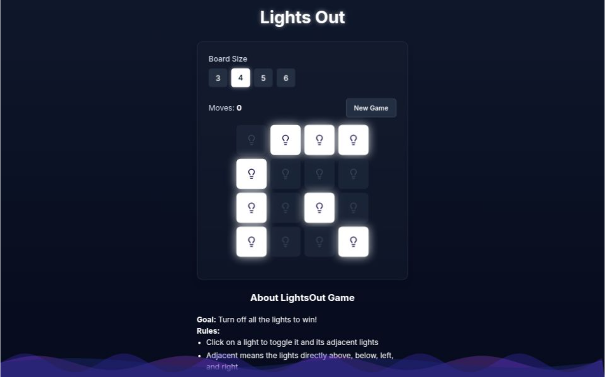

# 🔆 Lights Out Game

A classic puzzle game implementation where players must turn off all the lights on a grid by clicking them. Each click toggles the clicked light and its adjacent neighbors.



## 🎮 How to Play

1. Click on any light to toggle it and its adjacent lights (up, down, left, right)
2. The goal is to turn off all lights on the grid
3. Plan your moves carefully - each click affects multiple lights!
4. Try to solve the puzzle in the minimum number of moves

## ✨ Features

- **Multiple Grid Sizes**: Play on 3x3, 4x4, 5x5, and custom grid sizes
- **Move Counter**: Track your progress and try to beat your best score
- **Timer**: See how quickly you can solve each puzzle
- **Hint System**: Get hints when you're stuck
- **Level Generator**: Procedurally generated solvable puzzles
- **Responsive Design**: Optimized for desktop and mobile devices
- **Statistics**: Track your wins, best times, and average moves

## 🛠️ Tech Stack

- **Frontend**: HTML5, CSS3, Vanilla JavaScript (ES6+)
- **Styling**: CSS Grid/Flexbox for responsive layouts
- **Storage**: LocalStorage for saving game state and statistics
- **Build Tools**: Vite for development and bundling
- **Testing**: Jest for unit tests
- **Linting**: ESLint + Prettier for code quality
- **Deployment**: GitHub Pages / Netlify

## 📁 Project Structure

```
lights-out-game/
├── src/
│   ├── js/
│   │   ├── game.js          # Core game logic
│   │   ├── ui.js            # UI interactions
│   │   ├── solver.js        # Puzzle solving algorithms
│   │   └── utils.js         # Utility functions
│   ├── css/
│   │   ├── style.css        # Main styles
│   │   ├── themes.css       # Theme definitions
│   │   └── responsive.css   # Mobile responsiveness
│   ├── assets/
│   │   ├── images/          # Game images and icons
│   │   └── sounds/          # Sound effects
│   └── index.html           # Main HTML file
├── tests/
│   ├── game.test.js         # Game logic tests
│   └── solver.test.js       # Solver algorithm tests
├── docs/                    # Documentation
├── .github/
│   └── workflows/           # CI/CD workflows
├── package.json
├── vite.config.js
├── .eslintrc.js
├── .prettierrc
└── README.md
```

## 🚀 Getting Started

### Prerequisites

- Node.js (v16 or higher)
- npm or yarn package manager

### Installation

1. **Clone the repository**

   ```bash
   git clone https://github.com/mahmoudmahm00d/lights-out-game.git
   cd lights-out-game
   ```

2. **Install dependencies**

   ```bash
   npm install
   ```

3. **Start development server**

   ```bash
   npm run dev
   ```

4. **Open your browser**
   Navigate to `http://localhost:3000`

### Building for Production

```bash
npm run build
```

```bash
npm run start
```

## 🎯 Game Algorithm

The Lights Out puzzle is based on linear algebra over GF(2) (binary field). Key concepts:

- **Solvability**: Not all random configurations are solvable
- **Solution Uniqueness**: When solvable, the solution is unique
- **Matrix Representation**: Each puzzle can be represented as a system of linear equations
- **Gaussian Elimination**: Used to determine solvability and find solutions

## 🧩 Development

### Adding New Features

1. **New Grid Sizes**: Modify the `GRID_SIZES` constant in `game.js`

### Code Style

- Use ESLint and Prettier for consistent formatting
- Follow semantic commit messages
- Write tests for new features
- Update documentation for significant changes

### Performance Considerations

- Game state is optimized using bit manipulation
- Efficient algorithms for puzzle generation and solving
- Debounced resize handlers for responsive design

All data is stored locally and never transmitted.

## 🤝 Contributing

Contributions are welcome! Please feel free to submit a Pull Request. For major changes, please open an issue first to discuss what you would like to change.

1. Fork the repository
2. Create your feature branch (`git checkout -b feature/AmazingFeature`)
3. Commit your changes (`git commit -m 'Add some AmazingFeature'`)
4. Push to the branch (`git push origin feature/AmazingFeature`)
5. Open a Pull Request

## 📝 License

This project is licensed under the MIT License - see the [LICENSE](LICENSE) file for details.

## 🏆 Acknowledgments

- Inspired by the original Lights Out electronic puzzle game
- Thanks to the puzzle game community for algorithms and insights
- Icons provided by [Feather Icons](https://feathericons.com/)
- Sound effects from [Freesound](https://freesound.org/)

## 🔗 Links

- **Live Demo**: [Play the game](https://mahmoudmahm00d.github.io/lights-out-game)
- **Report Bug**: [GitHub Issues](https://github.com/mahmoudmahm00d/lights-out-game/issues)
- **Request Feature**: [GitHub Issues](https://github.com/mahmoudmahm00d/lights-out-game/issues)

---

**Made with ❤️ by [Mahmoud](https://github.com/mahmoudmahm00d)**
